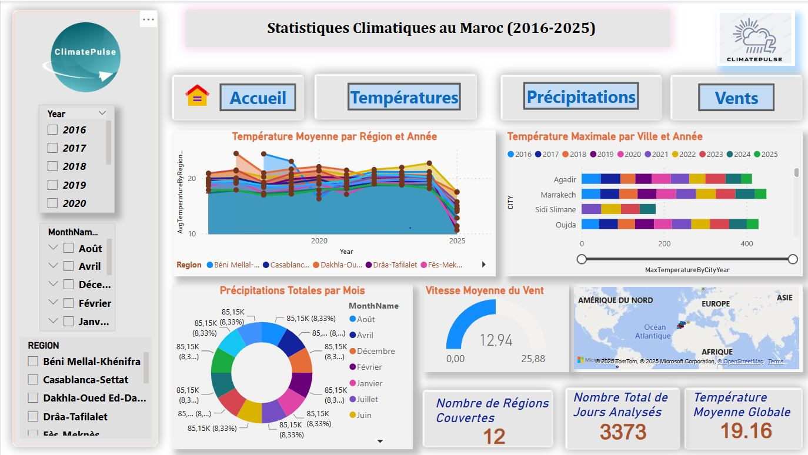

  <h1>🌦️ ClimatePulse</h1>
  
<strong>ClimatePulse</strong> est un projet de visualisation de données climatiques qui analyse les tendances météorologiques au Maroc de 2016 à 2025. Ce tableau de bord interactif, construit avec Power BI, offre une analyse approfondie des températures, des précipitations et des vents à travers les régions marocaines.

  

---

## 🌍 Aperçu du Projet
**ClimatePulse** combine des données climatiques historiques, un traitement avancé des données, et des visualisations interactives pour fournir des insights exploitables sur le climat au Maroc. Ce projet est idéal pour les chercheurs, les décideurs politiques, et les passionnés de données climatiques.

---

## 🚀 Fonctionnalités Principales

### 📥 Collecte et Traitement des Données
- Extraction de données climatiques historiques (températures, précipitations, vents) pour les villes marocaines.
- Nettoyage et standardisation des données avec **Power BI Power Query**.
- Enrichissement des données avec des informations géographiques (latitude, longitude, régions).

### 📊 Visualisation Interactive
- Tableaux de bord Power BI avec des pages dédiées :
  - **Températures** : Tendances annuelles et mensuelles par région.
  - **Précipitations** : Classement des villes les plus pluvieuses, analyses géographiques.
  - **Vents** : Vitesse moyenne, direction (rose des vents), et distribution.
- Filtres interactifs pour explorer les données par année, mois, et région.

### 🔍 Analyse Avancée
- Calcul des anomalies climatiques (écarts par rapport à la moyenne).
- Visualisations géographiques avec des cartes interactives.
- Classement des villes par précipitations totales.

---

## 🛠️ Technologies Utilisées
- **Collecte** : Python (Meteostat, Pandas), Web Scraping (Jupyter)
- **Nettoyage/ETL** : Power Query, Snowflake (stockage structuré)
- **Analyse/Visualisation** : Power BI, DAX (calculs avancés)
- **Gestion des données** : SQL (optimisation des requêtes)

---

## 📂 Structure du Projet

---

## 🔍 Fonctionnalités Détaillées

### Extraction et Transformation
- Nettoyage des données climatiques avec Power Query (suppression des valeurs manquantes, normalisation des formats).
- Création de colonnes calculées (ex. : `Year`, `MonthName`, `Season`).
- Enrichissement géographique avec les coordonnées des villes marocaines.

### Visualisation
- **Page Températures** : Graphiques en courbes pour les tendances annuelles et mensuelles, cartes des températures moyennes par région.
- **Page Précipitations** : Classement des villes les plus pluvieuses, carte des précipitations, histogramme de distribution.
- **Page Vents** : Rose des vents pour la direction, histogramme des vitesses de vent et des rafales.

### Analyse
- Calcul des anomalies de températures et de précipitations (écarts par rapport à la moyenne historique).
- Classement des villes par précipitations totales (ex. : Tanger, Rabat, Casablanca).
- Visualisations géographiques pour identifier les régions les plus pluvieuses ou venteuses.

---

## 📊 Résultats & Insights
- **Classement des Villes Pluvieuses** : Tanger et Rabat dominent avec des précipitations annuelles dépassant 700 mm.
- **Tendances Climatiques** : Augmentation des températures moyennes dans les régions du sud (ex. : Dakhla-Oued Ed-Dahab).
- **Vents Dominants** : Les régions côtières comme Agadir montrent des vents dominants de l’ouest (Atlantique).

### 📸 Captures d’Écran des Tableaux de Bord

Voici un aperçu des tableaux de bord interactifs de **ClimatePulse**, chacun dédié à une analyse spécifique des données climatiques au Maroc.

  <table>
    <tr>
      <td align="center">
        
        
<strong>Accueil</strong>

        
Page d'accueil offrant une vue d'ensemble des données climatiques avec des indicateurs clés.

      </td>
      <td align="center">
        
        
<strong>Températures</strong>

        
Analyse des tendances annuelles et mensuelles des températures par région, avec des cartes et des graphiques en courbes.

      </td>
    </tr>
    <tr>
      <td align="center">
        
        
<strong>Précipitations</strong>

        
Classement des villes les plus pluvieuses, carte des précipitations, et histogramme de distribution.

      </td>
      <td align="center">
        
        
<strong>Vents</strong>

        
Visualisation de la vitesse moyenne, de la direction (rose des vents), et de la distribution des vents.

      </td>
    </tr>
  </table>

---

## 📄 Licence
Projet sous licence [MIT](LICENSE).

---

## 👥 Auteurs
- **Jamal Oulachgar** - Data Analyst - [Profil GitHub](https://github.com/jamaloulachgar)

---

## 📬 Contact
- 📧 **Email** : [oulachgarjamal@gmail.com](mailto:oulachgarjamal@gmail.com)
- 🔗 **LinkedIn** : [Jamal Oulachgar](https://www.linkedin.com/in/jamal-oulachgar) *(Ajoute ton lien LinkedIn ici)*

---

## 💡 Dernière Mise à Jour
Mars 2025

---

  
⭐ Si ce projet vous a plu, n’hésitez pas à laisser une étoile sur GitHub ! ⭐

